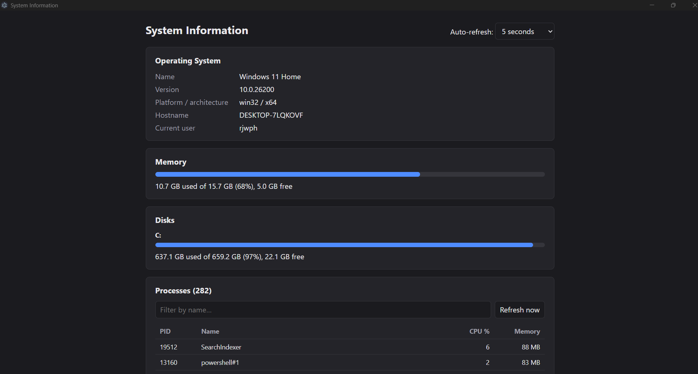
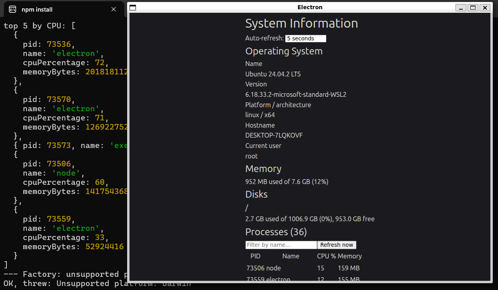
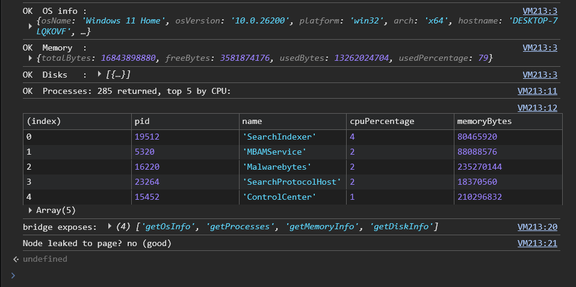
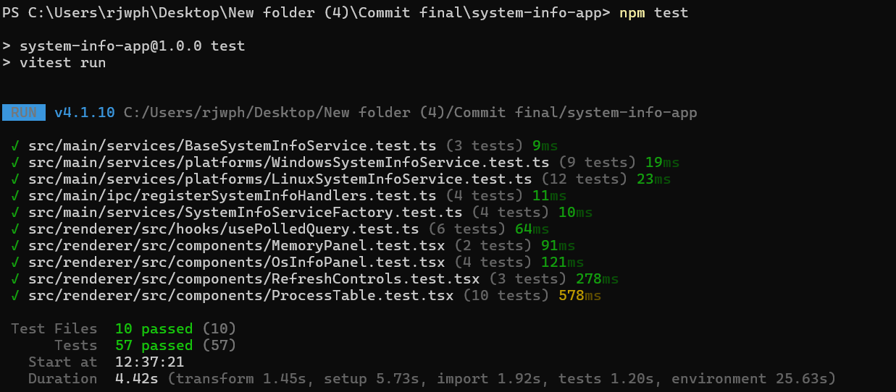
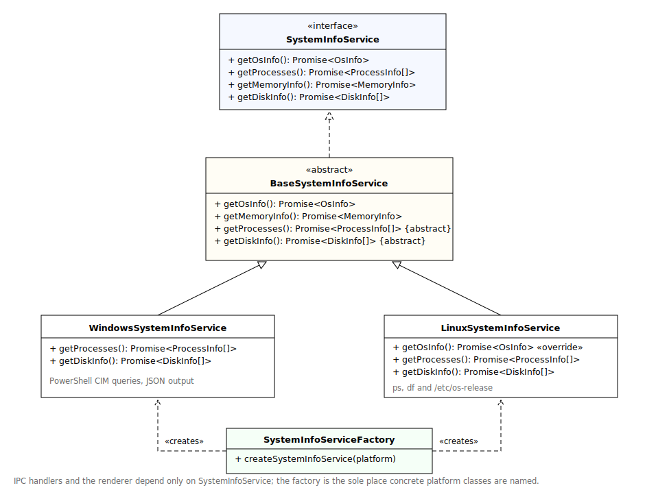
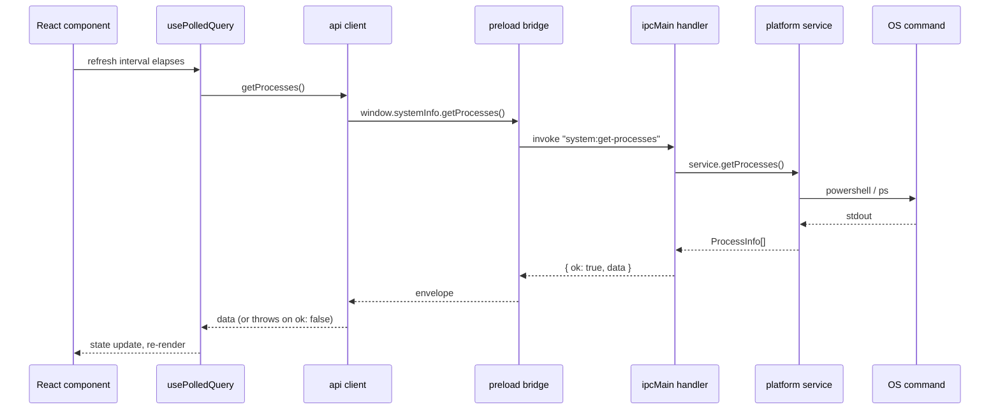

# System Information App

A desktop application built with Electron, React and TypeScript that displays live
information about the machine it is running on: operating system details, running
processes, memory usage and disk usage. Process data auto-refreshes at a user-chosen
interval (1s / 5s / 10s / manual only), and the process list supports sorting and
filtering.

I planned the build before starting; the original design notes are in [PLAN.md](PLAN.md).

## Screenshots

| Windows 11 | Linux (Ubuntu 24.04 under WSL2) |
| --- | --- |
|  |  |

Verification of the IPC bridge from DevTools (page has exactly four functions and no
Node access):



## Supported platforms

- **Windows** 10/11 (developed and tested on Windows 11 Home)
- **Linux** (tested on Ubuntu 24.04 under WSL2 with WSLg)

macOS is not implemented, but the design makes it a small addition; see
[Extending to another platform](#extending-to-another-platform).

## Requirements

- Node.js 20.19+ or 22.12+ (I used Node 22)
- npm

## Install

```bash
npm install
```

## Run

```bash
npm run dev
```

The factory detects the current platform at startup, so the same command shows Windows
data on Windows and Linux data on Linux with no configuration.

Note for WSL specifically: if your WSL session runs as root, Chromium refuses to start
its sandbox, so use `ELECTRON_DISABLE_SANDBOX=1 npm run dev` for that case only. This is
a WSL testing convenience, not something the app ships with.

## Run tests

```bash
npm test          # single run
npm run test:watch  # watch mode
```

The suite is 57 tests across 10 files. It covers: platform selection in the factory
(including the unsupported-platform error), the base service with Node's `os` module
mocked, the Windows and Linux parsers fed recorded real command output (plus garbage
input and PowerShell's single-result quirk), the polling hook under fake timers, and the
React components (rendering, loading and error states, filtering, sorting, manual
refresh, and changing the refresh interval) with the api client mocked. No test runs a
real OS command.



## Architecture

### Layers

```
src/
  shared/     type contracts + IPC channel names (imported by all layers, imports nothing)
  main/       Electron main process: platform services + IPC handlers
  preload/    the bridge: the only connection between renderer and main
  renderer/   React UI: api client, hooks, components
```

The renderer never calls Node or OS APIs. It talks to four functions exposed by the
preload script via `contextBridge`; `ipcRenderer` itself is never exposed to the page,
and the window runs with context isolation on and node integration off. Communication is
Electron IPC throughout; I considered and rejected an HTTP/REST layer as it would add
surface area for no benefit in a single-user desktop app.

### Platform abstraction

The core of the design is one interface with one implementation per platform:



- The **interface** is the contract everything downstream depends on; nothing outside the
  factory ever names a concrete platform class (dependency inversion).
- The **abstract base** implements the two methods that are identical everywhere (OS info
  and memory, via Node's `os` module) and forces subclasses to supply processes and disks.
- **Windows** queries CIM through PowerShell with JSON output
  (`Get-CimInstance ... | ConvertTo-Json`), so parsing is `JSON.parse` rather than text
  splitting. **Linux** uses `ps -eo pid=,pcpu=,rss=,comm=` and `df -kP`. The Linux service
  also overrides `getOsInfo` to upgrade the OS name from the kernel build string to the
  `PRETTY_NAME` in `/etc/os-release`, falling back to the base default if that file is
  unavailable.
- Parsers are exported **pure functions**, unit tested against recorded real command
  output.
- The **factory** takes a platform string (defaulting to `process.platform`) and returns
  the matching service, throwing a clear error for unsupported platforms. The platform is
  a parameter so tests can exercise every branch without faking globals.

### Data flow



### Error handling

IPC handlers catch service failures and return an envelope,
`{ ok: true, data } | { ok: false, error }`, so the renderer always receives a typed,
displayable result rather than a mangled exception. The api client unwraps the envelope,
the polling hook stores any error message, and each panel renders a readable error line
instead of crashing. Parsers skip malformed lines rather than failing the whole list, and
throw a clear message when the command output is not what they expect.

## Extending to another platform

Adding macOS support means:

1. Create `src/main/services/platforms/MacSystemInfoService.ts` extending
   `BaseSystemInfoService` and implementing `getProcesses` and `getDiskInfo`
   (`ps` and `df` largely carry over from Linux).
2. Add one `case 'darwin'` to the factory.

No changes to the IPC layer, preload, renderer or existing services are needed.

## Assumptions and limitations

- **Windows CPU percentages** come from `Win32_PerfFormattedData_PerfProc_Process`,
  where values are summed across cores; I divide by the core count, so a fully busy
  8-core machine shows a process at 100%, not 800%. The first CIM query after startup
  can take a second or two.
- **Linux "free" memory reads low** on a healthy machine because Linux uses spare RAM
  for disk cache and Node's `os.freemem()` reports strictly free memory. Counting
  "available" instead would need `/proc/meminfo` parsing, which I considered out of
  scope for the timebox.
- **Linux process names** are truncated to 15 characters (a `ps comm` limitation).
- **Disk listing** shows local fixed disks only: `DriveType=3` on Windows, `/dev/*`
  filesystems on Linux (this deliberately hides pseudo filesystems such as tmpfs and
  snap loop mounts).
- **Under WSL2** the app truthfully reports the WSL virtual machine's view: its own
  memory allocation and virtual disk, not the Windows host's.
- **Current user** is shown "if available" per the requirements; if the OS cannot
  resolve one, the UI shows "Not available" rather than failing.
- **Packaging/distribution** (installers, auto-update) is out of scope; the scaffold's
  electron-builder configuration was removed to keep the project focused. The app runs
  via `npm run dev`.
